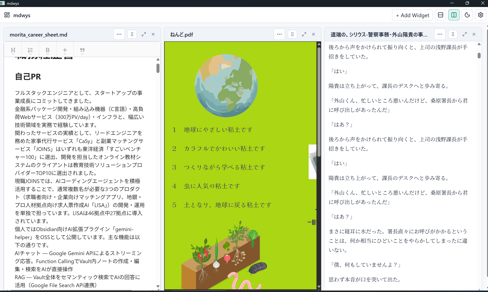
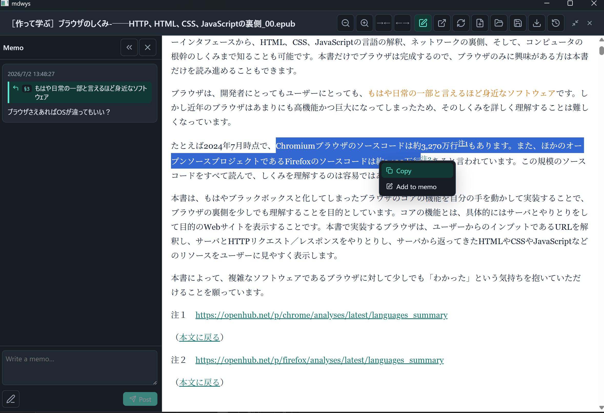

# GemiHub Desktop

> **AI が賢くなった今、データの価値はどんどん高まっています。**<br> **GemiHub DesktopはアイデアのためのIDE。感想、メモ、資料、活動記録や秘密のトークンなどあらゆる情報を自分のパソコンのディスクに集めて、AIのコンテキストに変える、オープンなワークスペースです。**
[English README](README.md)



## プロンプトではなく、いま取り組んでいるものから始める

**多くのAIツールはチャットボックスから始まります。GemiHubは、いま読んでいるものから始まります。**
ドキュメントを開き、重要な箇所を選択すれば、その作業と周辺情報をChat、メモ、Workflowの根拠あるコンテキストとして使えます。元の資料を離れ、その意味をプロンプトとして組み立て直す必要はありません。

**AIを使うための最高のインターフェースは、構文ではなく意図です。**
GemiHubでは、「この選択範囲について聞く」「これをメモする」「これらのnoteを整理する」「このWorkflowを実行する」といった意図そのものがインターフェースになります。file、選択範囲、現在のWorkspaceがコンテキストを運び、ユーザーは意図を伝えます。

## このアプリで実現したかったこと

GemiHub
Desktopは、これまで自作してきた3つのプロジェクトの発想を組み合わせたアプリです。

- **[mdwys](https://github.com/takeshy/mdwys)**の、すぐ開けてメモと出典を結びつけられるドキュメント閲覧・編集体験
- **[GemiHub](https://github.com/takeshy/gemihub)**の、RAG、OKF、AI Chat、Dashboard、Workflow機能
- **[obsidian-llm-hub](https://github.com/takeshy/obsidian-llm-hub)**で試してきた、LLM CLIとローカルmodelの連携

目標は、オンラインサービスを必須にせず、普段使いできる軽量なMarkdownアプリでAIをフル活用することです。runtimeを必要としない単一実行ファイルとして配布し、現在のWindows amd64 buildは20 MB未満です。

**Codexによって、「買う代わりに作る」は1時間で判断できる選択肢になりました。**
最初に動く実装をすぐ試せるほど開発コストが下がり、その後も実装、test、productの改善にCodexを活用しています。GemiHubはCodexで作られたproductであると同時に、ユーザー自身のコンテキストとCodexを組み合わせるための環境でもあります。

ファイルは通常のローカルファイルのままです。AIを使わなくても、閲覧・編集、引用付きメモ、Dashboard、Canvas、Base、Kanban、履歴、Trashを利用できます。必要なときだけ、OpenAI、Gemini、Vertex AI、Anthropic、Codex、Antigravity CLI,Local LLMへ同じWorkspaceから接続します。
CodexはGemiHubの開発に使うだけではありません。設定したCodex
CLIをChat、Workflowの作成・修正、Workflow内のLLM stepにも利用できます。
MCP Server、Agent Skill、OKF bundle、PluginとAIをフルで活用できる環境が整っています。

## できること

- **普段使いのMarkdownアプリにする。**
  `.md`へ関連付け、ExplorerやFinderからすぐ開き、Preview、WYSIWYG、Rawを切り替えて編集できます。
- **書いた場所を忘れたメモを意味で探す。** Markdown、text、PDF、対応mediaをLocal
  RAGへ索引し、ファイル名や保存場所を思い出せなくても検索できます。
- **雑なメモをAIに整えてもらう。**
  Chatへ清書、要約、分類、再構成を依頼し、提案されたfile変更を確認してから適用できます。
- **読書中の疑問や感想を出典と一緒に残す。**
  Markdown、PDF、EPUB、HTML、技術書を読みながら引用付きメモを作り、後からメモと原文を行き来できます。
- **情報収集を自動化する。**
  たとえば英語の技術記事をWorkflowで翻訳し、読みやすいインフォグラフィックnoteへ変換できます。
- **日々の作業をひとつの画面に集める。**
  KanbanやCalendarでTaskや予定を管理し、Timelineへ雑多な活動を記録し、よく使うfileへすぐアクセスしたり、アカウントなどの情報をパスワードをかけて必要な時に取り出せます。
- **会話をそのまま日々の記録にする。** ChatやDiscord
  Botへ「メモして」と頼むと、回答や要点をWorkspaceの標準Timelineへ保存できます。
- **自作アプリの知識をAIへ正確に渡す。** ドキュメントをOKF bundleというLLM
  Wikiにし、Chatから素早く根拠のある回答を得られます。
- **外部の作業環境と接続する。** MCP
  ServerでGit履歴から日報を作り、PluginでGoogle
  Driveなどへfileを同期・backupできます。

## PluginでWorkspaceを育てる

GemiHub Desktopは、内蔵のドキュメント機能やAI機能だけに限定されません。**Settings
→ Plugins**からPluginを追加すると、用途に特化したアプリケーションを同じローカルWorkspace内で利用できます。

- **[Audio Score](https://github.com/takeshy/hub-audio-score)**：機械学習による音高検出、音源分離、MIDI入出力、PDF出力、任意のAIコード解析を使い、音声から再生可能な楽譜を作成します。
- **[Accounting](https://github.com/takeshy/hub-accounting)**：Beancount互換の複式簿記、取引入力、検証、財務レポートを追加し、帳簿はplain textのまま保持します。
- **[Ronginus](https://github.com/takeshy/hub-ronginus)**：設定済みの複数AI・ローカルmodelへ異なる役割を与えて討論させ、結論と投票結果をまとめます。
- **[Google Drive Sync](https://github.com/takeshy/gemihub-gdrive)**：Desktop
  Workspace全体をGemiHubのGoogle Drive rootへ接続し、Pull/Push対象の事前確認とfile単位のconflict解消を提供します。

AIは任意です。API key、cloud
account、network接続がなくても、GemiHubはローカルのドキュメント・ナレッジWorkspaceとして動作します。

## スクリーンショット

### アイデアと出典をつないだままにする

Markdown、PDF、EPUB
の文章を選択し、引用付きのメモを作成できます。本文のハイライトからメモへ、メモの引用から原文へ移動できます。



### プロジェクトに合わせてワークスペースを組み立てる

資料やツールを行・列に配置し、Dashboard を可搬な YAML
ファイルとして保存できます。


### 知識を見失わない

メモのあるすべてのドキュメントを、最近の活動順に確認できます。


## アーキテクチャ

GemiHub Desktop は Go、Wails、Deno、Vite、React、Wysimark-lite、pdf.js
で構築されています。

デスクトップシェルが、ユーザーの選んだワークスペース内のローカルファイル操作を提供します。React
フロントエンドがドキュメントとワークスペースツールを描画し、AI
Provider、ローカル CLI、MCP Server、Skill、Plugin、YAML Workflow
が拡張可能なインテリジェンス層を構成します。

### 対応形式

- ドキュメント：Markdown、テキスト、HTML、PDF、EPUB、画像
- ワークスペース：Dashboard、Base、Kanban、JSON Canvas、Workflow YAML
- 暗号化ファイル：元の形式を保持する自己完結型の `.encrypted`

### セーフティモデル

- Workspace APIとAI file
  toolsは、選択したWorkspaceフォルダ内に限定されます。Workspace外から開いたファイルは、明示的に開いたFiles
  directory内に限定され、どちらのscopeでも`..`やシンボリックリンクによる脱出を拒否します。
- 上書き前のファイルを最大50世代保存し、削除したファイルは Trash
  から復元できます。
- AI が提案した編集やファイル名変更は、確認後にのみ適用されます。
- Plugin は `files`、`storage`、`network`、`llm` などの権限を宣言します。
- File Widgetのテキストは入力停止後に自動保存されます。暗号化テキストもsession
  passwordで再暗号化して自動保存し、binary previewはread-onlyです。

## インストール

GitHub Releases から実行ファイルをダウンロードしてください。実行時に Deno や Go
は必要ありません。

配布される実行ファイル：

- `gemihub-desktop-linux-amd64`
- `gemihub-desktop-linux-arm64`
- `gemihub-desktop-darwin-arm64`
- `gemihub-desktop-windows-amd64.exe`
- `gemihub-desktop-windows-arm64.exe`

各リリースには `THIRD_PARTY_NOTICES.md` も含まれます。同じ内容をアプリ内の
**Settings → General → Third-party notices** から確認できます。

Linux と macOS では、ダウンロードしたファイルに実行権限を付けます。

```bash
chmod +x gemihub-desktop-linux-amd64
```

macOS 版は現在未署名のため、初回起動前に quarantine 属性を削除してください。

```bash
xattr -d com.apple.quarantine gemihub-desktop-darwin-arm64
```

## クイックスタート

1. GemiHub Desktop を起動し、ローカルのワークスペースフォルダを選びます。
2. `+ Add Widget` を押すか、ファイルをウィンドウへドラッグします。
3. 資料を行または列に配置します。
4. AI を使う場合は Settings で有効にし、Provider を設定します。
5. `@file` でファイルを追加するか、文章を選択して右クリックメニューの
   「AIに相談」を使い、Chat に根拠を渡します。

OS の「プログラムから開く」または起動引数からもファイルを開けます。

```bash
gemihub-desktop note.md research.pdf book.epub
```

## 開発

必要な環境：

- Deno 2.9 以上
- Go 1.23 以上
- 利用する OS 向けの Wails platform dependencies

依存関係をインストールし、Web UI を起動します。

```bash
deno install --allow-scripts
deno task dev
```

デスクトップアプリを開発モードで起動します。

```bash
deno task desktop
```

型チェックとビルド：

```bash
deno task check
deno task build
deno task desktop:build
```

デスクトップビルドでは Developer Tools が有効です。`Ctrl+Shift+I`（macOS では
`Cmd+Option+I`）で WebView のインスペクターを開けます。

## 謝辞

GemiHub に組み込まれている Markdown、Base、Canvas の Agent Skill
には、[kepano/obsidian-skills](https://github.com/kepano/obsidian-skills)
を参考に翻案したドキュメントが含まれます。これらのファイル形式に対応する GemiHub
の機能は、公開されている仕様と振る舞いをもとに独自実装したものであり、Obsidian
のソースコードは使用していません。Canvas は、オープンな
[JSON Canvas 仕様](https://jsoncanvas.org/)に準拠しています。

成果をコミュニティへ公開してくださった Steph
Ango（@kepano）氏、プロジェクトのコントリビューター、JSON Canvas
のメンテナーの皆様に、心より敬意と感謝を表します。著作権およびライセンスの詳細は、[第三者ライセンス通知](THIRD_PARTY_NOTICES.md)をご覧ください。

GemiHub の WYSIWYG Markdown
エディターには、[portive/wysimark](https://github.com/portive/wysimark)
を軽量化したフォークである
[takeshy/wysimark-lite](https://github.com/takeshy/wysimark-lite)
を使用しています。MIT License のもとで基盤を公開してくださった Wysimark
の作者とコントリビューターの皆様に、敬意と感謝を表します。

GemiHub Desktop は
[Wails](https://wails.io/)（[wailsapp/wails](https://github.com/wailsapp/wails)）で構築されています。MIT
License のもとでフレームワークを公開してくださった Lea Anthony 氏と Wails
のコントリビューターの皆様に、敬意と感謝を表します。

GemiHub は独立したプロジェクトであり、Obsidian との提携または Obsidian
による承認を受けたものではありません。
